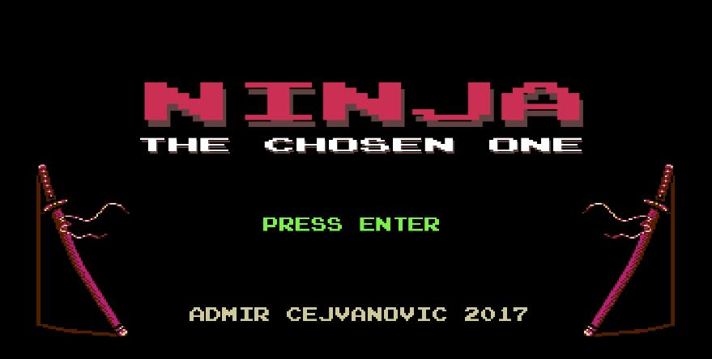
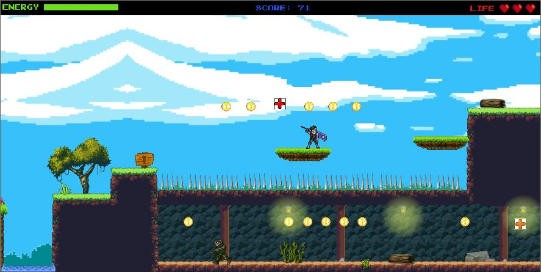
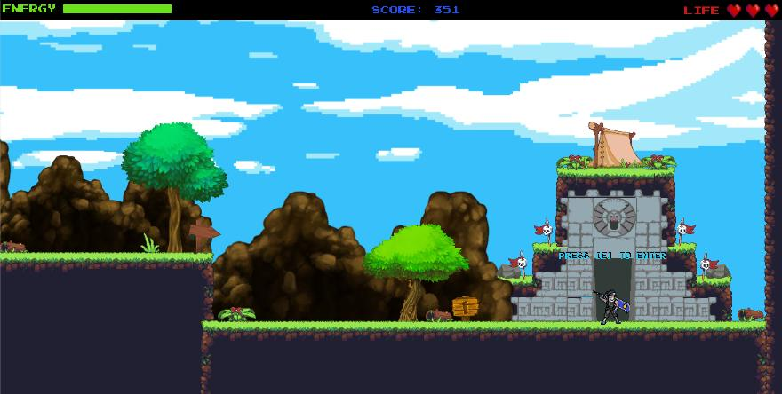
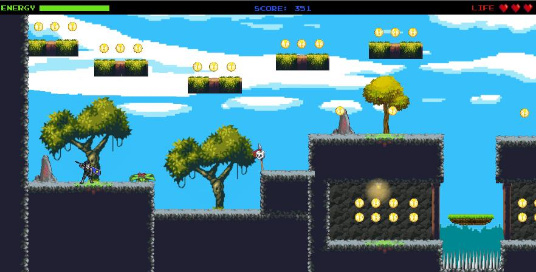
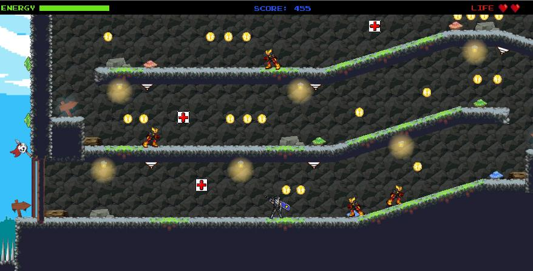

# Ninja The Chosen One

Like so many things distinctly human, video games were born out of a combination of innovation, necessity and curiosity. Video games represent the ultimate form of art because they combine almost every possible form of the art as a whole. This project is made out of pure hobby and curiosity.Full development of 2D platform video game is made in Unity game engine for a computer that runs on Windows operating system. The 2D platformer is type of video game where the whole gameplay revolves around the player who controls the character, that can move in 2D world, attack the enemies and jump on various platforms. The programming language used is C#.

## Technologies used

[] (https://www.microsoft.com/en-us/windows?r=1)

## In game screenshots

## Setup

This project needs to be imported into Unity game engine. The version used at the moment of developing this was: (2017.4.36f1). Once the import process is done you can build it and you will get build folder with exe file to run the game.

## Try out

If you are interested only in running the game without downloading and installing entire game engine that is also possible by downloading MasterBuild folder that contains exe file. Then you only run that file and you should be prompted with window with additional configuration like: screen size, graphics and buttons configuration. The game is optimized to run on Windows machine.
